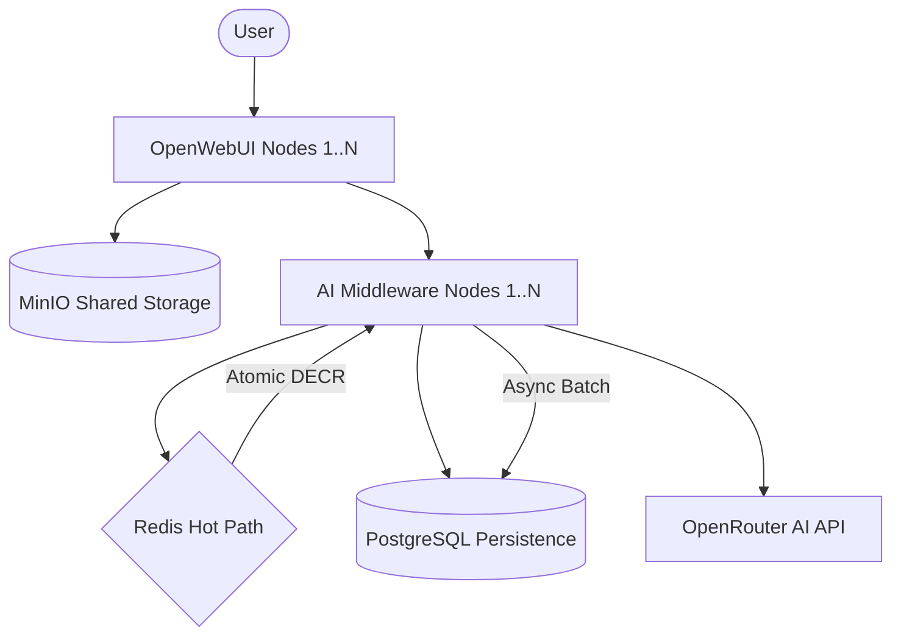

# AI Control Plane (OpenWebUI + OpenRouter Middleware)

High-performance, scalable middleware designed to manage OpenWebUI traffic to OpenRouter API with enterprise-grade features like auto-provisioning, global quota tracking, and shared storage.

## 🚀 Key Features

- **High Performance:** Built with [Bun](https://bun.sh/) and [ElysiaJS](https://elysiajs.com/), capable of handling **15,000+ requests per second**.
- **Auto-Provisioning:** Automatically registers new users from OpenWebUI headers/JWT upon their first request.
- **Global Quota Tracking:** Real-time token usage enforcement across multiple nodes using **Redis**.
- **Persistence:** Durable storage for users, policies, and detailed usage logs using **PostgreSQL**.
- **Scalable UI:** OpenWebUI is configured for horizontal scaling using **MinIO** as a shared object storage for files and assets.
- **Admin Control Plane:** Secured API endpoints for managing users, policies, and monitoring usage.
- **Kubernetes Ready:** Includes manifests for full-cluster deployment with HPA (Horizontal Pod Autoscaler).

## 🏗 Architecture



## 🛠 Tech Stack

- **Backend:** Bun, ElysiaJS
- **Data State:** Redis (Atomic counting, Rate limiting)
- **Database:** PostgreSQL (Persistence, Analytics)
- **Storage:** MinIO (S3-compatible shared storage)
- **Orchestration:** Docker Compose / Kubernetes (Minikube)

## 🚦 Deployment

### 1. Kubernetes (Recommended for Scale)

All manifests are located in the `/k8s` directory.

```bash
# Set up secrets
kubectl create secret generic ai-secrets --from-literal=OPENROUTER_API_KEY=your_key

# Apply configurations
kubectl apply -f k8s/redis.yaml
kubectl apply -f k8s/postgres.yaml
kubectl apply -f k8s/minio.yaml
kubectl apply -f k8s/middleware.yaml
kubectl apply -f k8s/openwebui.yaml

# Access the UI via port-forward
kubectl port-forward svc/openwebui-service 3000:80
```

### 2. Docker Compose (Quick Start)

```bash
cp .env.example .env
# Edit .env with your OPENROUTER_API_KEY
docker-compose up -d --build
```

## 🔐 Admin API

Access admin routes by providing the `x-admin-key` header.

- `GET /admin/users`: List all registered users.
- `GET /admin/policies`: View available usage policies.
- `GET /admin/usage`: Latest 100 usage logs.
- `POST /admin/policies`: Create/Update a policy.

## 📊 Performance Benchmarks (Middleware)

Tested on local Kubernetes cluster (5 replicas):
- **Requests per Second:** ~15,421 req/sec
- **Average Latency:** 31.5 ms
- **Success Rate:** 100%

---
Developed as a POC for scalable AI infrastructure.
